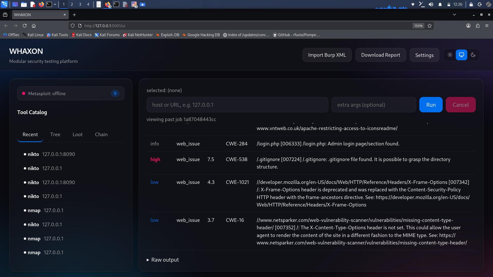
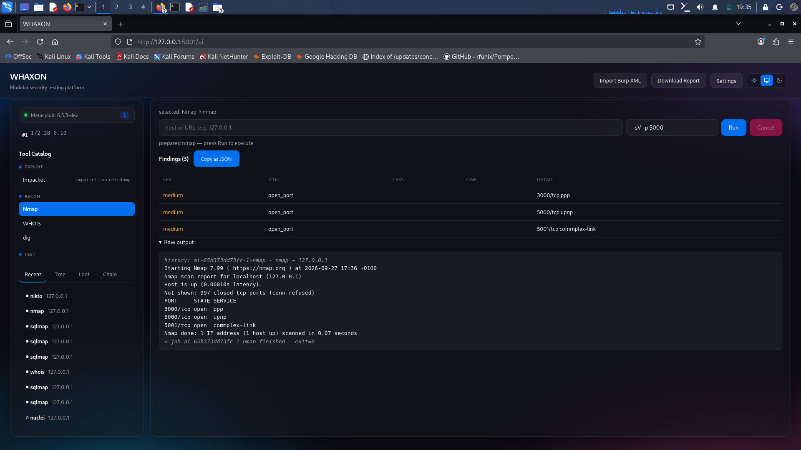
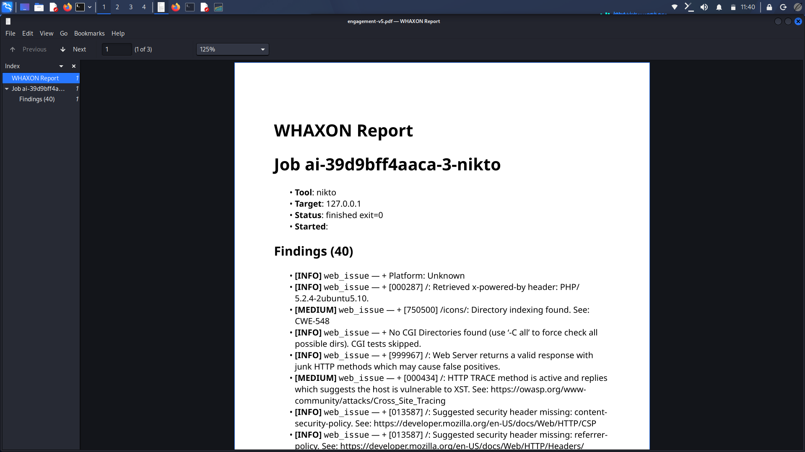

# WHAXON

**One platform. Every layer of security.**

A modular, portable cybersecurity testing platform with terminal, desktop, and web interfaces powered by a shared Python core.

## Status

**v0.2** — adapter architecture, enriched findings, three working interfaces, fail-closed scope, pivot chains.

### Working now

| Feature | Status |
| --- | --- |
| Headless core (catalog + runner + event bus) | Working |
| Terminal interface (Textual) | Working |
| Desktop interface (PySide6 + QWebEngineView) | Working |
| Web interface (Flask + SSE + Basic auth) | Working |
| Production WSGI server (`whaxon serve --daemon`) | Working |
| Tool catalog with argument templates | Working (11 tools) |
| Adapter layer | Working (7 adapters) |
| Enriched findings (CVSS, CWE, impact, remediation) | Working |
| Fail-closed scope enforcement | Working |
| Pivot chain graph + rendering | Working |
| Burp XML import | Working |
| SQLite persistence across all interfaces | Working |
| Reports (per-job MD/HTML + engagement MD/JSON) | Working |
| Evidence attachments | Working |
| Metasploit RPC integration | Working |
| Test suite | 54 passing |

### Planned

| Feature | Priority |
| --- | --- |
| Web UI file upload for Burp XML | Near term |
| Session tree (hosts, ports, findings) | Near term |
| Multi-user auth + projects | Medium term |
| AI-assisted next-step suggestions | Longer term |

## Quick start

    git clone https://github.com/andreipath26/WHAXON.git
    cd WHAXON
    python3 -m venv .venv
    source .venv/bin/activate
    pip install -e ".[tui,gui,web]"

Requires Python 3.11+.

    whaxon init                # create data/ with strict default scope
    whaxon tui                 # Terminal UI (Textual)
    whaxon gui                 # Desktop app (PySide6)
    whaxon serve --daemon      # Production web server
    whaxon web                 # Web, foreground (dev)

Web UI: <http://127.0.0.1:5001/ui>

### Configuration

| Variable | Default | Purpose |
| --- | --- | --- |
| `WHAXON_HOST` | `127.0.0.1` | Bind address |
| `WHAXON_PORT` | `5001` | Port |
| `WHAXON_DATA` | `data` | Data directory |
| `WHAXON_AUTH_USER` | `whaxon` | Basic auth username |
| `WHAXON_AUTH_PASS` | `whaxon` | Basic auth password |

**Change the auth credentials before exposing WHAXON on any network.**

## Adapters

Every tool can have an adapter — a Python class that parses its output and enriches findings.

Built-in: `nmap`, `nikto`, `sqlmap`, `burp`, `hashcat`, `impacket`, `msf`.

Catalog tools without an adapter still run; their output just isn't enriched.

See [docs/adapters.md](docs/adapters.md).

## Scope

Fail-closed. Missing `data/scope.json` gets a strict default on first load. Unreadable config raises.

    whaxon scope --show
    whaxon scope --check <target>
    whaxon scope --set scope.json
    whaxon scope --enable / --disable
    whaxon scope --clear

See [docs/scope.md](docs/scope.md).

## Interfaces

- **Terminal** (`whaxon tui`): `r` run, `x` cancel, `g` chain, `s` save report, `Ctrl+Q` quit.
- **Desktop** (`whaxon gui`): native window hosting the web UI in a `QWebEngineView`.
- **Web** (`whaxon serve --daemon`): Flask + SSE. API + browser UI at `/ui`.
- **CLI**: 15 subcommands — see [docs/interfaces.md](docs/interfaces.md).

## Reports

    whaxon report <job_id>                     # Per-job, Markdown
    whaxon report <job_id> --format html       # Per-job, HTML
    curl -u whaxon:whaxon "http://127.0.0.1:5001/api/report?fmt=md"     # Engagement

HTML output is escaped — a `raw_line` with `<script>` can't execute in a browser.

## Testing

    python -m pytest tests/ -q

54 tests passing.

## Documentation

[docs/](docs/) — getting started, architecture, adapters, tools, scope, interfaces, findings, reports, API, deployment, troubleshooting, changelog.

## Responsible use

Authorized testing only. Use on systems you own or have explicit permission to assess.

## Licensing

AGPL-3.0-or-later. See `LICENSE-COMMERCIAL.md` and `LICENSE-ENTERPRISE.md`.
